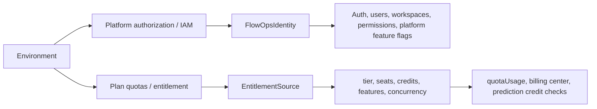

# FlowOps commercialization model

This document defines the boundary between platform authorization and commercial entitlements for FlowOps' two product shapes:

-   Private/self-managed deployment: customer runs FlowOps with self IAM and optional offline license.
-   Cloud SaaS: customer pays online and receives plan-based quotas through billing subscriptions.

## Two planes

Platform authorization and entitlement are related, but they are not the same contract.

Platform authorization answers: can this runtime boot the private platform surface, authenticate users, expose workspace/admin routes, and satisfy feature-flag call sites?

Entitlement answers: what commercial tier and usage limits does an organization currently have?

## Environment semantics

| Environment variable          | Plane                         | Meaning                                                                                                                                             |
| ----------------------------- | ----------------------------- | --------------------------------------------------------------------------------------------------------------------------------------------------- |
| `FLOWOPS_EDITION` / `EDITION` | Entitlement and product shape | `cloud` selects subscription-backed entitlement and exposes cloud-only billing/payment surfaces. Any other value is treated as `private`.           |
| `FLOWOPS_LOCAL_COMMERCIAL`    | Entitlement fallback          | Private/local fallback that grants enterprise-level quotas only when no license-backed entitlement is available. It does not select an IAM runtime. |

## Entitlement source selection

`createEntitlementSource()` is the entitlement-side switch:

| Edition         | Entitlement source              | Expected behavior                                                                                                                                              |
| --------------- | ------------------------------- | -------------------------------------------------------------------------------------------------------------------------------------------------------------- |
| `cloud`         | `SubscriptionEntitlementSource` | Resolve active `BillingSubscription` + `BillingPlan.entitlementTier`; no active subscription resolves to free.                                                 |
| private/default | `LocalEntitlementSource`        | Resolve active/offline license first. If no license entitlement exists, fallback is enterprise only when `isLocalCommercialEnabled()` is true; otherwise free. |

Entitlement-side parsing of `FLOWOPS_LOCAL_COMMERCIAL` must stay behind `isLocalCommercialEnabled(env)`. New entitlement code should not read `process.env.FLOWOPS_LOCAL_COMMERCIAL` directly.

## Expected combinations

| Edition         | `FLOWOPS_LOCAL_COMMERCIAL` | License/subscription state | Platform expectation               | Entitlement expectation                                     |
| --------------- | -------------------------- | -------------------------- | ---------------------------------- | ----------------------------------------------------------- |
| private/default | unset/false                | no license                 | Self IAM boots private runtime.    | `local/free`.                                               |
| private/default | true/1/yes/on              | no license                 | Self IAM boots private runtime.    | `local/enterprise` for local commercial/dev use only.       |
| private/default | any                        | active private license     | Self IAM boots private runtime.    | License-derived tier, seats, credits, features, and expiry. |
| `cloud`         | any                        | no active subscription     | Cloud product shape with self IAM. | `subscription/free`.                                        |
| `cloud`         | any                        | active subscription        | Cloud product shape with self IAM. | Subscription-derived tier and quotas from `BillingPlan`.    |

`FLOWOPS_LOCAL_COMMERCIAL` is intentionally entitlement-only after P4. It must stay behind `isLocalCommercialEnabled(env)` and must not be used to reintroduce an IAM runtime switch.

## Plan and quota ownership

Cloud plan ownership lives in billing data:

-   `BillingPlan.entitlementTier` maps an operator-managed plan to `free`, `pro`, `team`, or `enterprise`.
-   `BillingPlan.quotas` may override template values such as `tokens`, `seats`, `bots`, `creditsTotal`, `features`, or `concurrency`.
-   `BillingSubscription.status=active` selects the organization's current cloud plan.
-   Payment and plan prices remain integer cents through `monthlyPriceCents` and payment `amountCents`.

Private/self-managed entitlement ownership lives in local license state:

-   Active or grace/expired licenses are converted through the same snapshot shape as cloud subscriptions.
-   Without a license, private/default deployments resolve to free unless local commercial mode is explicitly enabled.

## Self IAM feature semantics

Self IAM does not implement SSO provider configuration. The user-facing self login payload therefore uses `getSelfEnterpriseFeatures()`, where `feat:sso-config` is false.

`FlowOpsIdentity.getFeaturesByPlan()` is a private-platform adapter. It returns string feature flags for call sites that still expect plan-shaped platform features. Current disabled-feature permission filtering for `feat:sso-config` is guarded by Cloud platform checks, so it is not the self IAM user-facing source of truth.

Rule for new self-track code:

-   For logged-in self users, use the features already attached by self auth, which come from `getSelfEnterpriseFeatures()`.
-   Do not infer self SSO availability from `FlowOpsIdentity.getFeaturesByPlan()`.
-   Do not expose SSO configuration in self mode unless a real self SSO implementation is added and the self feature map is updated intentionally.

## Non-goals

-   Do not move platform feature authorization into entitlement.
-   Do not use entitlement tiers to decide which IAM implementation boots; self IAM is the only runtime.
-   Do not add storage as an entitlement dimension unless product explicitly approves T3.
