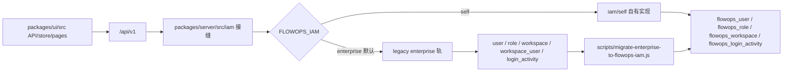

# FlowOps 自建 IAM 运行手册

本文记录 FlowOps 自建 IAM 的开发期架构、开关、迁移工具和后续出货化待办。
行为契约来源见 [iam-contract.md](./iam-contract.md)。

## 架构



`iam/identity.ts` 是平台身份门面。开发期保留双视图:

-   self 新代码使用 `getIdentityManager(): Promise<IFlowOpsIdentity>`。
-   legacy App 槽位使用 `getIdentityManagerForApp(): Promise<IdentityManager>`。
-   legacy 槽位进入 self-owned 上下文时使用 `toFlowOpsIdentityView(...)`。
-   两个转换器里的 `as unknown as` 是 T4.2 批准的接缝类型擦除桥;P3 剥离 enterprise 后删除。

## 开关

`FLOWOPS_IAM`:

-   未设置或 `enterprise`: 保持 legacy enterprise 轨行为。
-   `self`: 使用 `iam/self` 的认证、RBAC、工作区、平台路由和平台门面。

真机门禁注意:

-   后端真机前先在 `packages/server` 执行 `pnpm build`。
-   受保护 curl 请求需要 `x-request-from: internal` 才走 cookie JWT 分支。
-   测试业务对象使用可识别前缀并在链路尾删除。

## 数据迁移

脚本:

```bash
cd packages/server
node scripts/migrate-enterprise-to-flowops-iam.js
```

连接环境变量:

-   `PG_HOST`, 默认 `127.0.0.1`
-   `PG_PORT`, 默认 `5432`
-   `PG_USER`, 默认 `flowise`
-   `PG_PASSWORD`, 默认 `flowise`
-   `PG_DATABASE`, 默认 `flowise`

迁移规则:

-   `user` -> `flowops_user`: 保留 `id/email/name/credential/tempToken/tokenExpiry/status/createdDate/updatedDate`;
    `credential` bcrypt hash 原样复制;`lastLogin` 取该用户所有 `workspace_user.lastLogin` 的最大值。
-   `organization` -> `flowops_organization`: 保留 `id/name/createdDate/updatedDate`;
    `ownerUserId` 优先取源组织创建者,再回退到 owner membership 或首个用户。
-   `workspace` -> `flowops_workspace`: 保留 `id/name/description/organizationId/createdDate/updatedDate`。
-   `role` -> `flowops_role`: `owner/admin/member` 映射到已有内置角色;非内置角色按源 `id` 复制为自定义角色。
-   `workspace_user` -> `flowops_workspace_member`: 保留 `workspaceId/userId` 和映射后的 `roleId`;
    源表无独立 id,目标 `id` 用 `workspaceId:userId` 稳定生成。
-   `login_activity` -> `flowops_login_activity`: 保留 `id/message/attemptedDateTime`;
    `username` 按 email 映射到 `userId`, `activity_code` 转成字符串。

脚本会先清空 `flowops_login_activity/workspace_member/workspace/organization/user`,
并删除非内置 `flowops_role`;内置 `owner/admin/member` 保留。写入后逐表核对行数,
不一致时非零退出。

## 契约索引

-   UI 登录态与 auth/account/user 契约: [iam-contract.md](./iam-contract.md)
-   self 数据层: `packages/server/src/iam/self/entities`
-   self 认证: `packages/server/src/iam/self/auth`
-   self RBAC 与工作区: `packages/server/src/iam/self/rbac`, `packages/server/src/iam/self/admin`
-   self 平台门面与路由分流: `packages/server/src/iam/identity.ts`, `packages/server/src/iam/routes.ts`

## 已知差异

-   SSO 本期不实现;self 轨 `login-method` 只返回密码登录。
-   产品形态为单组织私有化部署;多组织/SaaS 多租户不在本计划内。
-   flowops membership 目标表有独立 id,legacy `workspace_user` 没有对应源 id,因此使用稳定生成 id。
-   迁移工具面向 PostgreSQL 真机库;全新安装使用 ship migration 集,不加载 enterprise migration。

## 出货构建

脚本:

```bash
scripts/build-ship.sh
```

流程:

1. 运行仓库级 `pnpm build`。
2. 剪除 `packages/server/dist/enterprise`。
3. 剪除 `packages/server/dist/IdentityManager.*`。
4. 剪除 server dist 中的编译测试产物 `*.test.js*`。
5. 剪除四库 migration 全集入口 `packages/server/dist/database/migrations/{postgres,mysql,mariadb,sqlite}/index.*`,ship 运行只保留 `index.ship.*`。
6. 调用 `scripts/verify-ship-dist.sh` 做零残留门禁。

校验项:

-   `packages/server/dist` 下不允许存在路径名包含 `enterprise` 的文件或目录。
-   `packages/server/dist/IdentityManager.*` 必须不存在。
-   server dist 的 `.js` 文件中,`src/enterprise` 或 `/enterprise/` 字符串只允许出现在 `packages/server/dist/iam/*.js` 接缝白名单中。
-   四库 `index.ship.js` 不允许包含 enterprise migration 类或 enterprise 路径。

ship dist 缺省:

-   `packages/server/dist/enterprise` 不存在时,`iam/provider.ts` 会强制返回 `self`。
-   即使客户环境误设 `FLOWOPS_IAM=enterprise`,ship dist 也会打印一行启动日志并进入 self 轨,避免裸 require 已剪除的 enterprise 产物。

出货物口径:

-   源码包排除 `src/enterprise`, `src/IdentityManager.ts` 和 `.planning`。
-   dist 由 `scripts/build-ship.sh` 生成并剪除。
-   打包格式由发布流水线决定;本脚本只负责构建、剪除和校验。

## P3 待办

-   出货构建物理剥离 `src/enterprise/` 与 `IdentityManager.ts`,并确保发布包不包含商业授权文件。
-   App 身份槽位从 legacy `IdentityManager` 翻转为 `IFlowOpsIdentity`,所有新代码只保留 self 视图。
-   删除 `getIdentityManagerForApp`, `toFlowOpsIdentityView` 和 `[key: string]: any` 兼容垫。
-   迁移出货版 migration 集:全新安装不再加载 enterprise migration,既有库只通过本工具迁移一次。
-   dist/源码门禁新增 enterprise 路径零残留检查,包括 import、编译产物和运行包。
-   清理开发期双轨开关的 enterprise 默认分支,将 self 轨设为唯一生产路径。
