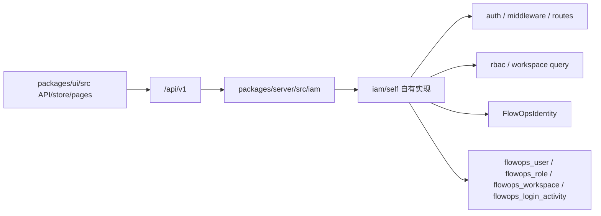

# FlowOps 自建 IAM 运行手册

本文记录 P4 之后的 FlowOps IAM 形态。当前 server 是单轨 self IAM:

-   `packages/server/src/enterprise/**` 已物理删除。
-   `packages/server/src/IdentityManager.ts` 已物理删除。
-   `FLOWOPS_IAM` 不再选择运行时实现;`iam/provider.ts` 仅保留兼容导出并恒定返回 `self`。
-   `App.identityManager` 类型为 `IFlowOpsIdentity`,由 `FlowOpsIdentity.getInstance()` 注入。

行为契约来源见 [iam-contract.md](./iam-contract.md)。

## 架构



IAM 顶层文件只做 self 实现的稳定出口:

| 顶层入口            | 当前实现                                                                     |
| ------------------- | ---------------------------------------------------------------------------- |
| `iam/security.ts`   | `iam/self/security.ts` 的哈希与密码校验                                      |
| `iam/middleware.ts` | `iam/self/middleware.ts` 的 RBAC 校验                                        |
| `iam/query.ts`      | `iam/self/workspace/query.ts` 的工作区作用域查询                             |
| `iam/entities.ts`   | `iam/self/entities/**` 的 `flowops_` 实体和公共类型                          |
| `iam/boot.ts`       | `iam/self/auth/passport.ts`, `iam/self/middleware.ts`, `iam/self/secrets.ts` |
| `iam/routes.ts`     | `iam/self/auth/routes.ts` 与 `iam/self/admin/routes.ts`                      |
| `iam/sso.ts`        | 私有版空 SSO provider 白名单                                                 |
| `iam/services.ts`   | `FlowOpsWorkspaceService` 与 `FlowOpsWorkspaceUserService`                   |
| `iam/identity.ts`   | `FlowOpsIdentity` 的 `IFlowOpsIdentity` 门面                                 |

## 身份门面

`FlowOpsIdentity` 是唯一身份门面:

-   平台类型返回私有化部署需要的自有固定值。
-   权限来自 `iam/self/rbac/permissions.ts`。
-   私有版不提供 SSO provider 配置,初始化方法为明确的自有空操作。
-   私有版不提供 Stripe 云计费 API,相关方法显式抛出 `501` 错误。

禁止重新引入以下旧形态:

-   `IdentityManager.ts`
-   `getIdentityManagerForApp`
-   `toFlowOpsIdentityView`
-   `as unknown as` 身份槽类型擦除
-   lazy `require('../enterprise')`

## 数据迁移

全新安装直接通过四库 migration 创建 `flowops_` IAM 表。

历史库迁移工具仍保留:

```bash
cd packages/server
node scripts/migrate-enterprise-to-flowops-iam.js
```

连接环境变量:

-   `PG_HOST`, 默认 `127.0.0.1`
-   `PG_PORT`, 默认 `5432`
-   `PG_USER`, 默认 `flowise`
-   `PG_PASSWORD`, 默认 `flowise`
-   `PG_DATABASE`, 默认 `flowise`

迁移规则:

-   `user` -> `flowops_user`: 保留 `id/email/name/credential/tempToken/tokenExpiry/status/createdDate/updatedDate`;
    `credential` bcrypt hash 原样复制;`lastLogin` 取该用户所有 `workspace_user.lastLogin` 的最大值。
-   `organization` -> `flowops_organization`: 保留 `id/name/createdDate/updatedDate`;
    `ownerUserId` 优先取源组织创建者,再回退到 owner membership 或首个用户。
-   `workspace` -> `flowops_workspace`: 保留 `id/name/description/organizationId/createdDate/updatedDate`。
-   `role` -> `flowops_role`: `owner/admin/member` 映射到已有内置角色;非内置角色按源 `id` 复制为自定义角色。
-   `workspace_user` -> `flowops_workspace_member`: 保留 `workspaceId/userId` 和映射后的 `roleId`;
    源表无独立 id,目标 `id` 用 `workspaceId:userId` 稳定生成。
-   `login_activity` -> `flowops_login_activity`: 保留 `id/message/attemptedDateTime`;
    `username` 按 email 映射到 `userId`, `activity_code` 转成字符串。

脚本会先清空 `flowops_login_activity/workspace_member/workspace/organization/user`,
并删除非内置 `flowops_role`;内置 `owner/admin/member` 保留。写入后逐表核对行数,
不一致时非零退出。

## 已知差异

-   SSO 本期不实现;登录方法只返回密码登录。
-   产品形态为单组织私有化部署;多组织/SaaS 多租户不在本计划内。
-   `flowops_workspace_member` 有独立 id,历史 `workspace_user` 没有对应源 id,因此迁移工具使用稳定生成 id。
-   P5 之前不调整 self license/entitlement 收费体系。

## 出货构建

脚本:

```bash
scripts/build-ship.sh
```

流程:

1. 运行仓库级 `pnpm build`。
2. 删除 server dist 中的编译测试产物 `*.test.js*`。
3. 调用 `scripts/verify-ship-dist.sh` 做 removed-source 门禁。

校验项:

-   `packages/server/dist` 下不允许出现 `enterprise` 目录产物。
-   `packages/server/dist/IdentityManager.*` 必须不存在。
-   server dist 的 `.js` 文件不允许引用已删除 IAM 源码路径或 `IdentityManager`。
-   四库 migration 入口不允许注册已删除 IAM migration 类。

## 常用门禁

```bash
test ! -d packages/server/src/enterprise
test ! -f packages/server/src/IdentityManager.ts
rg -n "src/enterprise|/enterprise/|\\.\\./enterprise|IdentityManager|getIdentityManager|FLOWOPS_IAM|loadEnterprise|getEnterprise" packages/server/src
cd packages/server && npx tsc --noEmit --pretty false
cd packages/server && npx jest
```
